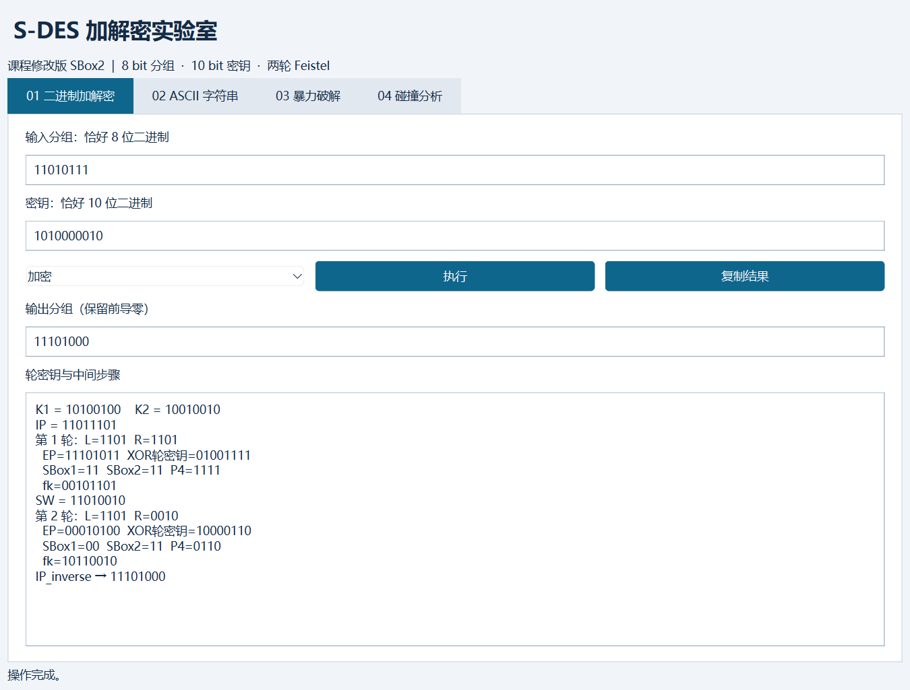
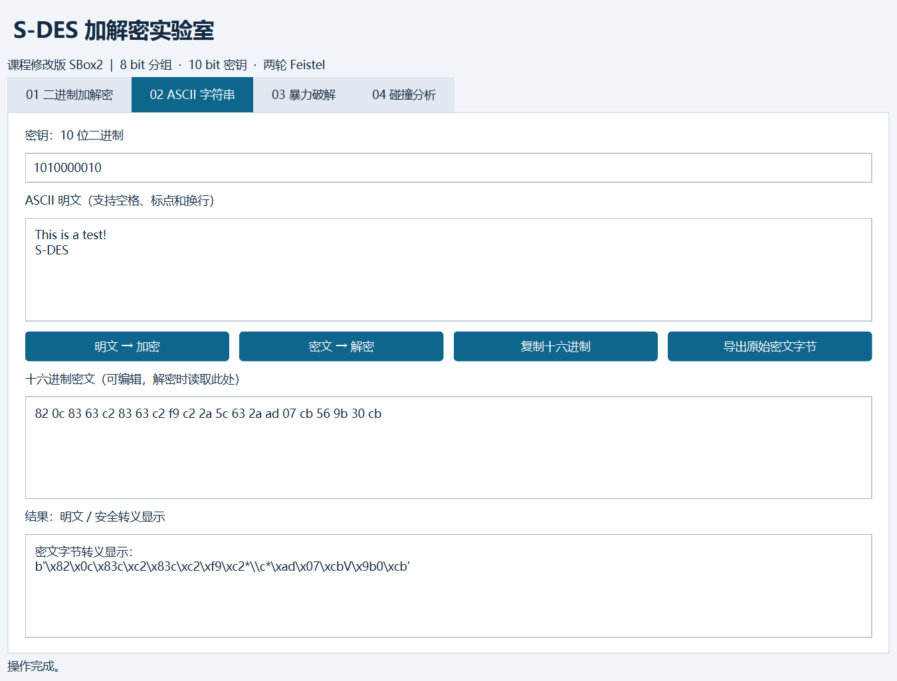
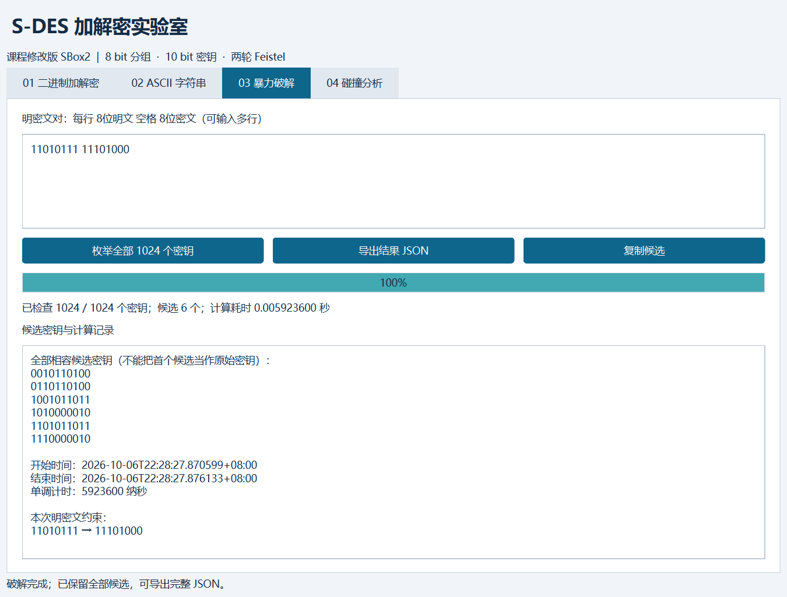
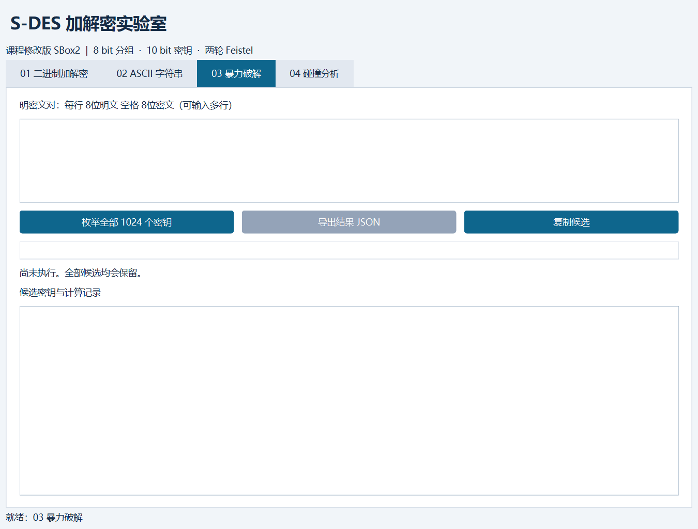
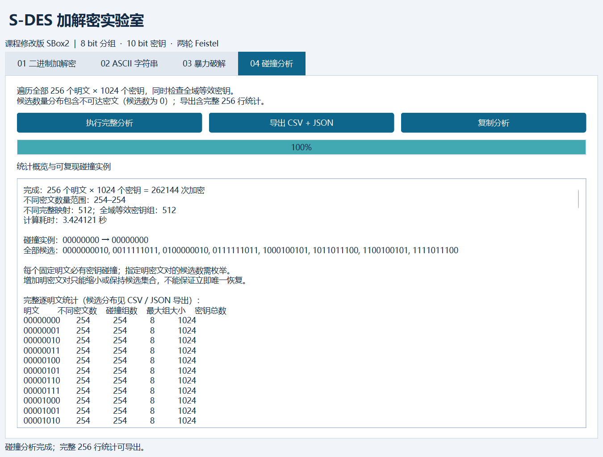

# 信息安全导论课程作业报告

## S-DES 加解密、暴力破解与密钥碰撞分析

| 项目 | 内容 |
|---|---|
| 课程名称 | 信息安全导论 |
| 作业名称 | S-DES 加解密程序设计 |
| 开发语言 | Python 3.12 |
| GUI框架 | PySide6 6.8.3 |
| 小组成员1 | 李政豫 ／20246446 |
| 小组成员2 | 杨涵 ／20246464 |
| 完成日期 | 2026年10月7日 |
| 项目仓库 | [SDES_Lab1](https://github.com/LZY0813/SDES_Lab1) |

---

## 摘要

本项目根据课程给定的 S-DES 标准，使用 Python 实现了8-bit分组、10-bit密钥的加密和解密，并开发了包含二进制加解密、ASCII字符串处理、暴力破解和碰撞分析四个页面的图形界面。程序严格采用作业给定的 P10、P8、IP、IP⁻¹、EP、SP及课程修改版SBox2。

除基本功能外，项目遍历全部1024个可能密钥完成已知明密文攻击，并对全部256个明文和1024个密钥进行了262144次加密统计。实验发现，本密钥扩展规则下1024个主密钥只对应512种不同的完整加密映射，存在512组两两等效密钥。因此，即使增加任意数量的明密文对，也不一定能唯一恢复原始10-bit主密钥。

项目使用Python整数位运算和JavaScript位数组两套独立实现进行全域交叉验证；全部262144组加密结果一致，双向解密检查524288次，错误数为0。此外，本项目实际复现了公开仓库 `wen-yan-chen/sdes-project` 的基本向量、暴力破解候选和碰撞分布，结果一致。

**关键词：** S-DES；分组密码；Feistel结构；暴力破解；密钥碰撞；等效密钥

---

## 1. 作业任务与需求分析

### 1.1 作业目标

根据课程讲授的S-DES算法，实现可交互的加解密程序，并依次完成五个关卡：

| 关卡 | 作业要求 | 本项目实现 |
|---|---|---|
| 第1关 | 8-bit数据、10-bit密钥的GUI加解密 | 完成，并显示逐轮过程 |
| 第2关 | 不同程序使用相同标准得到一致结果 | 完成双实现全域验证及公开仓库数据复现；人工跨组签认待补 |
| 第3关 | 支持ASCII字符串逐字节加解密 | 完成，使用HEX安全展示密文 |
| 第4关 | 穷举密钥并记录时间 | 完成，保留全部候选并支持多组明密文对 |
| 第5关 | 分析密钥碰撞和密钥唯一性 | 完成全部256×1024组合及全域等效密钥分析 |

### 1.2 设计原则

1. 严格使用作业文档中的转换表和修改版SBox2；
2. 核心算法与GUI分离，便于测试和复用；
3. 对输入长度、字符范围、ASCII和HEX格式进行严格验证；
4. 暴力破解返回所有相容密钥，而不是找到第一个后停止；
5. 实验结论必须由可复现数据支持。

---

## 2. S-DES算法设计

### 2.1 算法参数

| 参数 | 设定 |
|---|---|
| 分组长度 | 8 bit |
| 主密钥长度 | 10 bit |
| 子密钥数量 | 2个，每个8 bit |
| 轮数 | 2轮 |
| 加密流程 | `IP → fk(K1) → SW → fk(K2) → IP⁻¹` |
| 解密流程 | `IP → fk(K2) → SW → fk(K1) → IP⁻¹` |

加密与解密分别表示为：

```text
C = IP⁻¹(fK2(SW(fK1(IP(P)))))
P = IP⁻¹(fK1(SW(fK2(IP(C)))))
```

### 2.2 置换表

| 名称 | 位置序列 |
|---|---|
| P10 | `(3,5,2,7,4,10,1,9,8,6)` |
| P8 | `(6,3,7,4,8,5,10,9)` |
| IP | `(2,6,3,1,4,8,5,7)` |
| IP⁻¹ | `(4,1,3,5,7,2,8,6)` |
| EP | `(4,1,2,3,2,3,4,1)` |
| SP | `(2,4,3,1)` |

### 2.3 S-Box

SBox1：

| 行\列 | 00 | 01 | 10 | 11 |
|---|---:|---:|---:|---:|
| 00 | 1 | 0 | 3 | 2 |
| 01 | 3 | 2 | 1 | 0 |
| 10 | 0 | 2 | 1 | 3 |
| 11 | 3 | 1 | 0 | 2 |

课程修改版SBox2：

| 行\列 | 00 | 01 | 10 | 11 |
|---|---:|---:|---:|---:|
| 00 | 0 | 1 | 2 | 3 |
| 01 | 2 | 3 | 1 | 0 |
| 10 | 3 | 0 | 1 | 2 |
| 11 | 2 | 1 | 0 | 3 |

对四位输入 `b1b2b3b4`，行号由 `b1b4` 组成，列号由 `b2b3` 组成，S-Box输出固定为2 bit。

### 2.4 密钥扩展

作业公式为：

```text
Ki = P8(Shift^i(P10(K))), i=1,2
```

本项目据此执行：

1. 对10-bit主密钥执行P10；
2. 将结果分成左右两个5-bit半区；
3. 从P10结果分别循环左移1位，经P8得到K1；
4. 再次从原P10结果分别循环左移2位，经P8得到K2。

K2不是在K1的Shift¹结果上继续移动2位，因此不采用累计3位移位。

### 2.5 轮函数

一轮 `fk` 的计算过程如下：

```text
输入 L||R
R → EP → XOR子密钥 → SBox1/SBox2 → SP → F(R,K)
输出 (L XOR F(R,K)) || R
```

两轮之间通过SW交换左右两个4-bit半区。解密复用同一结构，只需逆序使用K2和K1。

---

## 3. 系统设计与实现

### 3.1 项目结构

```text
sdes-course-project/
├─ src/sdes/
│  ├─ core.py             # 核心算法、ASCII处理
│  ├─ analysis.py         # 暴力破解、碰撞分析
│  └─ gui.py              # PySide6图形界面
├─ reference/sdes.js      # JavaScript独立参考实现
├─ tests/                 # 自动化测试
├─ scripts/
│  ├─ validate.py         # 重建全域验证数据
│  └─ capture_gui.py      # GUI操作、截图与GIF
├─ results/               # 实验数据和证据
├─ docs/                  # 算法、用户及开发文档
└─ run.py                 # 程序入口
```

### 3.2 核心接口

| 函数 | 功能 |
|---|---|
| `parse_bits(text, width)` | 校验并解析固定宽度二进制字符串 |
| `subkeys(key)` | 由10-bit主密钥生成K1、K2 |
| `crypt(block, key, decrypt=False)` | 单个8-bit分组加密或解密 |
| `trace(block, key, decrypt=False)` | 返回子密钥和全部中间步骤 |
| `encrypt_ascii(text, key)` | ASCII字符串逐字节加密 |
| `decrypt_ascii(data, key)` | 密文字节逐字节解密 |
| `brute_force(pairs)` | 根据一个或多个明密文对穷举密钥 |
| `collision_analysis()` | 完整密钥碰撞和等效密钥统计 |

### 3.3 GUI设计

GUI包含四个页面：

| 页面 | 功能 |
|---|---|
| 二进制加解密 | 输入8-bit分组和10-bit密钥，显示结果及逐轮过程 |
| ASCII字符串 | 文本加解密、HEX显示、原始密文字节导出 |
| 暴力破解 | 输入多组明密文对、显示进度、候选和时间戳 |
| 碰撞分析 | 枚举全部组合、显示分布和等效密钥信息 |

耗时任务使用单个QThread执行，使界面在计算期间保持响应。该线程用于GUI响应，不宣称是并行破解加速。

---

## 4. 第1关：基本加解密测试

### 4.1 测试向量

| 项目 | 数值 |
|---|---|
| 明文P | `11010111` |
| 密钥K | `1010000010` |
| P10(K) | `1000001100` |
| K1 | `10100100` |
| K2 | `10010010` |
| IP(P) | `11011101` |
| 第1轮fk | `00101101` |
| SW | `11010010` |
| 第2轮fk | `10110010` |
| 密文C | `11101000` |
| 解密结果 | `11010111` |

### 4.2 测试结果

- 加密结果与逐位推导一致；
- 解密恢复原始明文；
- 输入不足8位、密钥不足10位或包含非二进制字符时，GUI给出错误提示；
- 输出始终保留前导零。



**结论：第1关通过。**

---

## 5. 第2关：交叉测试

### 5.1 Python与JavaScript独立实现

Python版本使用整数位运算，JavaScript版本使用位数组。两者按固定顺序遍历全部1024个密钥和256个明文，生成262144个密文字节。

| 指标 | 实际结果 |
|---|---:|
| 比较记录数 | 262144 |
| 加密一致数 | 262144 |
| 不一致数 | 0 |
| 双向解密检查 | 524288 |
| 往返错误 | 0 |
| 有序密文字节SHA-256 | `ed05dd58f52ca19005ada061ed0cd2ae58eb493872a7e685fbafca88e91fd4d0` |

### 5.2 参考仓库公开数据复现

参考仓库：[wen-yan-chen/sdes-project](https://github.com/wen-yan-chen/sdes-project)。

#### 基本加解密

| 测试项 | 输入 | 参考结果 | 本项目结果 | 状态 |
|---|---|---|---|---|
| K1生成 | `K=1010000010` | `10100100` | `10100100` | 一致 |
| K2生成 | `K=1010000010` | `10010010` | `10010010` | 一致 |
| 加密 | `P=10111101` | `C=11000011` | `C=11000011` | 通过 |
| 解密 | `C=11000011` | `P=10111101` | `P=10111101` | 通过 |

#### 暴力破解候选

共同明密文对为 `10111101 → 11000011`：

| 序号 | 参考仓库候选 | 本项目候选 | 状态 |
|---:|---|---|---|
| 1 | `0000010001` | `0000010001` | 一致 |
| 2 | `0100010001` | `0100010001` | 一致 |
| 3 | `1010000010` | `1010000010` | 一致 |
| 4 | `1110000010` | `1110000010` | 一致 |

#### 固定明文碰撞分布

固定明文为 `10111101`：

| 指标 | 参考结果 | 本项目结果 | 状态 |
|---|---:|---:|---|
| 遍历密钥数 | 1024 | 1024 | 一致 |
| 不同密文数 | 254 | 254 | 一致 |
| 2个密钥对应同一密文 | 40个 | 40个 | 一致 |
| 4个密钥对应同一密文 | 172个 | 172个 | 一致 |
| 6个密钥对应同一密文 | 40个 | 40个 | 一致 |
| 8个密钥对应同一密文 | 2个 | 2个 | 一致 |

以上结果证明两个项目采用相同的算法参数和密钥扩展规则。机器可读记录见 `results/test_vectors/reference_repo_comparison.csv`。

需要说明：公开仓库复现不等同于双方学生直接交换程序并签认，正式跨组测试仍需填写组员、运行环境、日期和确认人。

**结论：程序级交叉验证通过，人工跨组签认待完成。**

---

## 6. 第3关：ASCII字符串扩展

### 6.1 实现方法

将ASCII字符串编码为字节序列，每个字节作为一个8-bit分组独立加密。由于密文字节可能是控制字符或乱码，GUI使用十六进制显示，同时支持导出原始二进制文件。

### 6.2 测试数据

| 项目 | 结果 |
|---|---|
| 明文 | `This is a pen` |
| 字符数 | 13 |
| 密文长度 | 13 byte = 104 bit |
| HEX密文 | `82 0C 83 63 C2 83 63 C2 F9 C2 4F 5C 7E` |
| 解密结果 | `This is a pen` |

参考仓库README将该字符串的密文长度写为112 bit；由于字符串实际为13个ASCII字符，正确长度应为 `13×8=104 bit`。两个项目底层密文字节一致，区别仅在展示形式：参考项目使用连续二进制，本项目使用HEX。

自动测试还覆盖空字符串、空格、标点、LF、CR、TAB、全部0—127 ASCII字符、非法HEX以及非ASCII输入。



**结论：第3关通过。**

---

## 7. 第4关：暴力破解

### 7.1 破解方法

程序从0到1023遍历全部10-bit密钥。若当前密钥对所有已知明密文对均满足：

```text
E(K, Pi) = Ci
```

则将该密钥保留为候选。程序不会在发现第一个候选后提前退出。

### 7.2 单组明密文实验

| 项目 | 数值 |
|---|---|
| 明文 | `11010111` |
| 密文 | `11101000` |
| 测试密钥数 | 1024 |
| GUI实测耗时 | 约0.005923600秒 |
| 候选数量 | 6 |

全部候选：

| 序号 | 候选密钥 |
|---:|---|
| 1 | `0010110100` |
| 2 | `0110110100` |
| 3 | `1001011011` |
| 4 | `1010000010` |
| 5 | `1101011011` |
| 6 | `1110000010` |

### 7.3 多组明密文筛选

| 明密文对数量 | 候选数量 |
|---:|---:|
| 1 | 6 |
| 2 | 2 |
| 3 | 2 |
| 4 | 2 |
| 5 | 2 |
| 6 | 2 |
| 7 | 2 |

加入第二组数据后，候选缩小为 `1010000010` 和 `1110000010`。继续增加本次选择的明密文对仍无法区分二者，原因是它们属于全域等效密钥。





**结论：第4关通过；单组明密文对不能唯一确定主密钥。**

---

## 8. 第5关：封闭测试与密钥碰撞

### 8.1 理论分析

对任意固定明文P，密钥空间有1024个元素，而密文空间只有256个元素。由抽屉原理，映射：

```text
K → E(K, P)
```

必然存在不同密钥得到相同密文。

### 8.2 完整枚举结果

程序对全部256个明文和1024个密钥进行了262144次加密。

| 指标 | 实验结果 |
|---|---:|
| 每个明文对应的不同密文数 | 254 |
| 每个明文的不可达密文数 | 2 |
| 单个明密文对最大候选数 | 8 |
| 1024个密钥形成的不同完整映射 | 512 |
| 全域等效密钥组 | 512组 |
| 每组等效密钥数量 | 2 |

完整数据见 `results/collision_statistics.csv`。

### 8.3 全域等效密钥

例如：

| 密钥 | 数值 |
|---|---|
| K₁ | `1010000010` |
| K₂ | `1110000010` |

二者对全部256个明文产生完全相同的密文，因此它们不是只在某个明文上偶然碰撞，而是代表相同的完整加密函数。

该现象产生以下结论：

1. 任意数量的明密文对都无法区分一组全域等效密钥；
2. 暴力破解最终保留两个候选不是程序错误；
3. 本密钥调度虽然接收1024个主密钥，但实际只有512种不同加密映射；
4. 指定明密文对可能不可达或对应多个密钥；本参数下不存在只对应一个主密钥的明密文对。



**结论：第5关通过；S-DES同时存在局部密钥碰撞和全域等效密钥。**

---

## 9. 测试环境与质量保证

### 9.1 环境

| 项目 | 版本 |
|---|---|
| 操作系统 | Windows 11 |
| Python | 3.12.6 |
| PySide6 | 6.8.3 |
| pytest | 8.3.5 |
| Node.js | 24.14.0 |

### 9.2 自动化测试

| 测试类别 | 结果 |
|---|---:|
| pytest测试 | 33项通过，0失败 |
| GUI自动操作 | 15项通过 |
| Python/JavaScript加密比较 | 262144项一致 |
| 双向解密检查 | 524288次，错误0 |

测试覆盖：

- 固定逐轮向量；
- IP与IP⁻¹互逆；
- 全部S-Box输入；
- 全部1024×256组合的加解密往返；
- 前导零及非法输入；
- ASCII和HEX边界；
- 暴力破解候选完整性；
- 碰撞统计守恒关系；
- GUI按钮、错误提示、后台任务和导出功能。

截图与GIF由自动化脚本操作真实Qt窗口生成，并只截取本程序客户区，不读取桌面其他区域。

---

## 10. 项目特点与不足

### 10.1 项目特点

1. 显示完整的子密钥和两轮中间过程，便于教学检查；
2. 两种编程语言独立实现并进行全域验证；
3. 暴力破解支持多个明密文约束和全部候选导出；
4. 第5关不仅统计单个明文碰撞，还检查全部密钥的完整映射；
5. 实验数据、截图和GIF均可由脚本重新生成；
6. 使用HEX展示密文，避免乱码影响复制和提交。

### 10.2 当前不足

1. 未实现可选的TCP网络通信；
2. 暴力破解使用单个后台线程保持GUI响应，未采用多线程并行加速；
3. 公开仓库复现不是双方学生直接签认的正式跨组测试；
4. 两名成员仍需人工复核课程参数和最终结果。

---

## 11. 总结

本项目完成了课程要求的S-DES加解密、ASCII扩展、暴力破解和封闭测试。基本算法经过固定向量、全域往返及两种语言独立实现验证，结果一致。公开参考仓库的基本测试向量、四个暴力破解候选和固定明文碰撞分布也均可复现。

实验表明，较小的10-bit密钥空间使S-DES能够在毫秒级被穷举；同时，密钥空间大于分组输出空间使固定明文下的密钥碰撞不可避免。更进一步，本密钥扩展规则会产生512组全域等效密钥，使某些不同主密钥在所有明文上完全无法区分。这说明教学型简化密码能够帮助观察Feistel结构、密钥调度、穷举攻击和密钥等价等重要概念，但不适用于任何真实安全场景。

## 参考资料

1. 《信息安全导论》第5次课S-DES算法及作业说明。
2. 交叉测试仓库：[wen-yan-chen/sdes-project](https://github.com/wen-yan-chen/sdes-project)。
3. 本项目算法规范：[docs/algorithm_spec.md](docs/algorithm_spec.md)。
4. 本项目开发手册：[docs/developer_guide.md](docs/developer_guide.md)。
5. 本项目测试数据：[results/](results/)。

---

## 附录：复现命令

安装并启动：

```powershell
.\setup.bat
.\start.bat
```

运行测试：

```powershell
.\.venv\Scripts\python.exe -m pytest -q
```

重建算法验证和统计数据：

```powershell
.\.venv\Scripts\python.exe scripts\validate.py
```

重新生成GUI截图和破解GIF：

```powershell
.\.venv\Scripts\python.exe scripts\capture_gui.py
```
